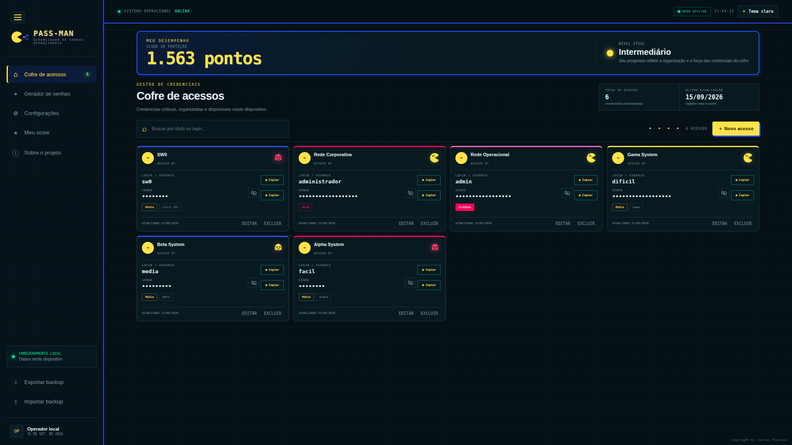
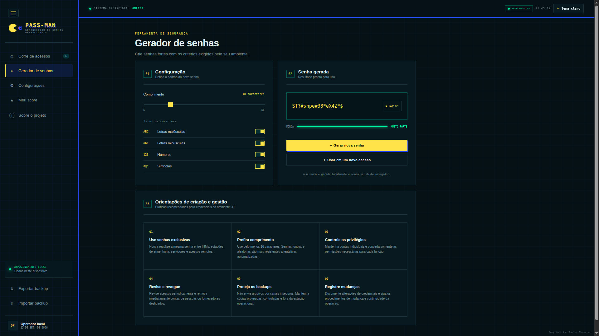
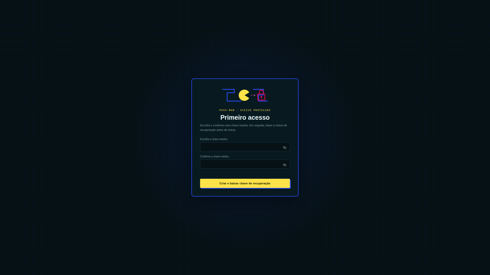
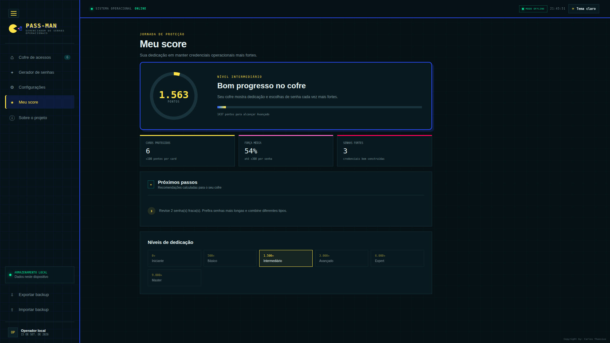

<div align="center">

# 🕹️ Pass-Man

### *Gerenciador Local de Senhas Operacionais com Gamificação para Ambientes OT*

<p align="center">
  
  
  
  
</p>

<p align="center">
  <b>Desenvolvido por <a href="https://github.com/carlosthassius">Carlos Thassius</a></b>
</p>

</div>

---

> ⚠️ **Aviso Importante — Local-First**
>
> O cofre existe **exclusivamente no armazenamento local do navegador (`LocalStorage`)**. Limpar os dados do site, trocar de perfil/navegador ou remover o armazenamento local pode apagar o cofre.
>
> **Exporte e armazene backups criptografados com frequência fora do navegador.**

---

## 📸 Interface

<div align="center">

<table>
  <tr>
    <td width="50%">
      
      <p align="center"><b>Dashboard do Cofre</b></p>
    </td>
    <td width="50%">
      
      <p align="center"><b>Gerador Criptográfico de Senhas</b></p>
    </td>
  </tr>
  <tr>
    <td width="50%">
      
      <p align="center"><b>Primeiro Acesso e Configuração</b></p>
    </td>
    <td width="50%">
      
      <p align="center"><b>Gamificação e Score de Segurança</b></p>
    </td>
  </tr>
</table>

</div>

---

## 💡 Visão Geral

O **Pass-Man** é um gerenciador local de credenciais desenvolvido com foco em **segurança, privacidade e educação em boas práticas de autenticação em ambientes de Tecnologia Operacional (OT)**.

A aplicação permite cadastrar, pesquisar, editar e excluir credenciais compostas por título, login e senha, organizando-as em um **cofre criptografado localmente**.

A identidade visual utiliza referências genéricas ao universo dos jogos arcade, combinando elementos de labirinto, pontuação e personagens para transformar a avaliação da segurança das credenciais em uma experiência mais interativa.

### 🎯 Objetivo

Mais do que armazenar senhas, o Pass-Man busca **ensinar o usuário a criar e manter credenciais mais seguras**.

O sistema possui um motor de avaliação em tempo real que analisa características das credenciais, gera pontuações e utiliza elementos visuais para indicar vulnerabilidades e oportunidades de melhoria.

---

## ✨ Principais Recursos

* 🔐 **Local-First:** processamento e armazenamento realizados localmente no navegador.
* 🚫 **Zero Backend:** não depende de servidor para armazenar credenciais.
* 📡 **Zero Telemetria:** nenhuma credencial é enviada para serviços externos.
* 🕹️ **Gamificação:** sistema de pontuação, níveis e feedback visual.
* 🎲 **Gerador criptograficamente seguro:** utiliza `crypto.getRandomValues()`.
* 🔑 **Chave mestra:** utilizada para proteger o acesso ao cofre.
* ♻️ **Chave de recuperação:** gerada automaticamente no primeiro acesso.
* 📦 **Backups criptografados:** exportação completa ou seletiva.
* 🧪 **Autoteste de backup:** validação criptográfica antes do download.
* 📋 **Limpeza automática da área de transferência:** após dois minutos.
* 🏷️ **Classificação operacional:** criticidade, sistema, área, proprietário e fornecedor.
* 🎨 **Interface responsiva:** suporte a temas claro e escuro.
* 🔒 **CSP restritiva:** aplicação preparada para operação sem conexões externas.

---

# 🏭 Contexto em Ambientes OT

Ambientes de **Tecnologia Operacional (OT)** apresentam requisitos específicos relacionados a disponibilidade, segurança, continuidade operacional e controle de acesso.

Na rotina de **Automação e Sistemas de Controle**, profissionais podem lidar com credenciais utilizadas em:

* IHMs;
* estações de engenharia;
* sistemas SCADA;
* PLCs;
* RTUs;
* IEDs;
* equipamentos de telecomunicações;
* switches e roteadores industriais;
* servidores e estações de operação.

O armazenamento inadequado de credenciais, reutilização de senhas ou utilização de senhas previsíveis pode aumentar o impacto de um acesso indevido.

O Pass-Man foi desenvolvido como uma **solução experimental e educacional**, explorando como conceitos de segurança, criptografia, UX e gamificação podem ser aplicados ao contexto de OT.

> ⚠️ **Importante:** o Pass-Man é um projeto local demonstrativo e **não substitui soluções corporativas auditadas de PAM, IAM ou gerenciamento de segredos**.

---

# 🚀 Execução

O projeto não utiliza frameworks, pré-processadores ou ferramentas de build.

Não é necessário instalar `npm`, Node.js ou dependências externas.

### 1. Clone o repositório

```bash
git clone https://github.com/carlosthassius/Pass-Man.git
cd Pass-Man
```

### 2. Execute um servidor HTTP local

Para maior consistência e compatibilidade com a **Web Crypto API**, recomenda-se servir a aplicação através de um servidor HTTP local.

Com Python:

```bash
python -m http.server 8080
```

### 3. Acesse a aplicação

Abra:

```text
http://localhost:8080
```

Também é possível abrir diretamente o `index.html`, embora o uso de um servidor local seja recomendado.

### 4. Primeiro acesso

Na primeira execução:

1. Crie uma chave mestra;
2. Confirme a chave;
3. Utilize pelo menos 8 caracteres;
4. Inclua letras maiúsculas, minúsculas, números e caracteres especiais.

### 5. Guarde a chave de recuperação

No primeiro acesso, o Pass-Man gera uma **chave de recuperação**.

Guarde esse arquivo em um local seguro.

A chave é necessária caso a chave mestra seja perdida e possui uso único: após uma recuperação bem-sucedida, ela é invalidada e uma nova chave é gerada.

---

# 🔐 Arquitetura Criptográfica

## Cofre Local

Os dados do cofre são serializados em um payload JSON e cifrados utilizando **AES-256-GCM**, fornecendo confidencialidade e autenticação dos dados.

### Parâmetros

| Componente       | Implementação       |
| ---------------- | ------------------- |
| Algoritmo        | AES-GCM             |
| Tamanho da chave | 256 bits            |
| IV               | 96 bits aleatórios  |
| Salt             | 128 bits aleatórios |
| KDF              | PBKDF2-HMAC-SHA-256 |
| Iterações        | 600.000             |
| API              | Web Crypto API      |
| Armazenamento    | LocalStorage        |

O armazenamento persistente contém apenas:

* metadados criptográficos;
* salt;
* IV;
* parâmetros necessários para derivação;
* ciphertext.

Título, login, senha e metadados operacionais recebem a mesma proteção criptográfica.

---

## 🔑 Gerenciamento de Chaves

A **chave mestra não é armazenada diretamente**.

Ela é utilizada para proteger uma chave interna do cofre. Essa chave interna é mantida somente em memória durante a sessão desbloqueada.

As credenciais descriptografadas também permanecem disponíveis somente enquanto o cofre está desbloqueado.

Ao bloquear o cofre:

* a chave interna é removida da memória da aplicação;
* as credenciais deixam de estar disponíveis na interface;
* o usuário precisa realizar um novo desbloqueio.

### Sessão

A sessão possui limite absoluto de **1 hora**.

A chave não é persistida no `sessionStorage`, portanto uma recarga da aplicação exige novo desbloqueio.

---

# 🔑 Chave de Recuperação

Durante o primeiro acesso, o aplicativo gera automaticamente uma chave de recuperação com identificador único.

Ela permite redefinir a chave mestra do cofre local caso a chave original seja perdida.

Fluxo simplificado:

```text
Primeiro acesso
      │
      ▼
Geração da chave de recuperação
      │
      ▼
Usuário armazena o arquivo
      │
      ▼
Perda da chave mestra
      │
      ▼
Recuperação autenticada
      │
      ▼
Chave anterior invalidada
      │
      ▼
Nova chave de recuperação gerada
```

A chave utilizada para recuperação é invalidada após o uso.

---

# 📦 Backups Criptografados

O Pass-Man permite exportar:

* todo o cofre;
* registros selecionados.

Cada backup possui uma **chave exclusiva**, independente da chave mestra do cofre.

Para cada exportação são gerados:

* novo salt;
* nova chave derivada;
* novo IV.

A chave mestra do cofre e a chave derivada **nunca são incluídas no arquivo de backup**.

---

## Estrutura do Envelope JSON

Exemplo simplificado:

```json
{
  "app": "Pass-Man",
  "version": 2,
  "encryption": {
    "algorithm": "AES-256-GCM",
    "kdf": "PBKDF2-HMAC-SHA-256",
    "iterations": 600000
  },
  "salt": "base64...",
  "iv": "base64...",
  "ciphertext": "base64...",
  "scope": "full",
  "itemCount": 10
}
```

---

## 🧪 Autoteste de Download

Antes de disponibilizar o arquivo para download, a aplicação:

1. gera o envelope criptografado;
2. descriptografa o envelope em memória;
3. recupera os dados;
4. compara o conteúdo recuperado com os registros selecionados;
5. somente então disponibiliza o arquivo.

Isso permite detectar falhas no processo de serialização, criptografia ou geração do arquivo antes que o backup seja entregue ao usuário.

---

# 🔄 Migração de Dados

Versões anteriores utilizavam a estrutura:

```text
passman_credentials_v1
```

Após um desbloqueio válido, os registros antigos são migrados para:

```text
passman_encrypted_vault_v2
```

A aplicação remove a estrutura anterior em texto aberto após a migração.

---

# 🎲 Gerador de Senhas

O gerador utiliza:

```javascript
crypto.getRandomValues()
```

em vez de:

```javascript
Math.random()
```

O usuário pode selecionar:

* comprimento entre **6 e 64 caracteres**;
* letras maiúsculas;
* letras minúsculas;
* números;
* símbolos.

Quando classes de caracteres são selecionadas, o algoritmo garante a presença de pelo menos um caractere de cada classe e realiza o embaralhamento do resultado.

---

# 🕹️ Gamificação

Um dos principais diferenciais do Pass-Man é transformar a avaliação de segurança das credenciais em uma experiência interativa.

O sistema calcula um **score educativo em tempo real**, incentivando o usuário a melhorar a qualidade das credenciais cadastradas.

## 📊 Regras do Score

* ➕ **+100 pontos** por credencial cadastrada;
* ➕ **até +300 pontos adicionais** por credencial;
* 📈 bônus relacionados à complexidade e variedade de caracteres;
* 📉 penalidades para padrões previsíveis;
* 📉 penalidades para repetições;
* 📉 penalidades para palavras-chave comuns;
* 💡 identificação de reutilização de senhas;
* 💡 recomendações de melhoria.

Exemplos de padrões considerados:

```text
1234
123456
qwerty
admin
senha
```

> O score é **puramente educativo**, calculado localmente e não é persistido como informação de segurança.

---

# 👻 Indicadores Visuais

Cada credencial recebe um indicador visual baseado em sua pontuação.

|     Score | Classificação | Indicador             |
| --------: | ------------- | --------------------- |
|    `< 40` | 🔴 Fraca      | Monstrinho estressado |
| `40 – 64` | 🟡 Média      | Monstrinho atento     |
|     `65+` | 🟢 Forte      | Carinha satisfeita    |

A classificação serve como mecanismo de **feedback educativo**, e não como uma estimativa formal de resistência criptográfica ou de tempo necessário para quebra.

---

# 🏆 Níveis do Jogador

A pontuação acumulada também determina o nível do jogador.

|     Pontuação | Nível             | Classificação            |
| ------------: | ----------------- | ------------------------ |
|       0 – 499 | 🐣 Iniciante      | Aprendiz de Segurança    |
|   500 – 1.499 | 🟡 Básico         | Operador Inicial         |
| 1.500 – 2.999 | 🛡️ Intermediário | Analista Prático         |
| 3.000 – 5.999 | ⚔️ Avançado       | Guardião do Cofre        |
| 6.000 – 8.999 | 🌟 Expert         | Mestre em Cripto         |
|        9.000+ | 👑 Master         | Defensor de Nível Mestre |

---

# 🛡️ Privacidade

O Pass-Man segue uma abordagem **Local-First**.

### Não existe:

* ❌ backend;
* ❌ banco de dados remoto;
* ❌ API para envio de credenciais;
* ❌ telemetria;
* ❌ analytics;
* ❌ sincronização em nuvem.

Os dados sensíveis permanecem exclusivamente no navegador.

---

## 🔒 Content Security Policy

A aplicação utiliza uma **Content Security Policy (CSP)** restritiva.

Não são utilizadas:

* fontes externas;
* scripts externos;
* folhas de estilo externas;
* imagens hospedadas externamente.

A política também utiliza:

```text
connect-src 'none'
```

impedindo conexões iniciadas pela aplicação.

Recomenda-se testar a aplicação em uma estação com os adaptadores de rede desativados para verificar seu comportamento completamente offline.

---

# 📋 Área de Transferência

Quando o usuário copia um login ou senha, o Pass-Man agenda a limpeza da área de transferência após **2 minutos**.

O navegador pode impedir essa operação caso a página perca o foco ou não possua mais permissão para modificar o clipboard.

Quando isso acontece, a aplicação informa o usuário.

---

# 🏷️ Classificação Operacional OT

Cada credencial pode receber metadados relacionados ao contexto operacional:

* **Criticidade:** Baixa, Média, Alta ou Crítica;
* **Sistema;**
* **Área;**
* **Proprietário;**
* **Fornecedor.**

Essas informações são armazenadas **dentro do payload criptografado** e também participam das pesquisas realizadas localmente.

Não são mantidas cópias separadas em texto aberto.

---

# ⚠️ Limitações e Modelo de Ameaça

A criptografia em repouso não protege os dados enquanto o cofre está desbloqueado.

Um atacante que já tenha comprometido a estação pode potencialmente acessar os dados enquanto eles estiverem disponíveis em memória ou na interface.

O projeto não pretende proteger contra:

* malware presente na estação;
* keyloggers;
* extensões de navegador comprometidas;
* código malicioso executado na mesma origem;
* comprometimento do navegador;
* captura de tela;
* acesso físico à estação desbloqueada;
* comprometimento do sistema operacional.

Por isso, o Pass-Man deve ser considerado uma **ferramenta experimental/educacional**, e não um substituto para uma arquitetura corporativa de gerenciamento de credenciais.

---

# 🏢 Uso Corporativo

Para utilização em ambientes corporativos de produção, recomenda-se considerar controles adicionais, como:

* MFA;
* PAM;
* IAM;
* trilhas de auditoria;
* rotação periódica de credenciais;
* HTTPS;
* hardening das estações;
* segmentação de redes OT;
* controle de acesso baseado em função;
* revisão independente do código;
* políticas de recuperação;
* gestão centralizada de segredos.

---

# 🛠️ Tecnologias

| Tecnologia          | Utilização                        |
| ------------------- | --------------------------------- |
| **HTML5**           | Estrutura e semântica             |
| **CSS3**            | Interface, responsividade e temas |
| **JavaScript ES6+** | Lógica da aplicação               |
| **Web Crypto API**  | Criptografia e geração segura     |
| **LocalStorage**    | Persistência local                |
| **SVG**             | Elementos visuais                 |
| **Git/GitHub**      | Versionamento e colaboração       |

O projeto não utiliza frameworks JavaScript nem ferramentas de build.

---

# 📁 Estrutura do Projeto

```text
Pass-Man/
├── index.html
├── styles.css
├── app.js
│
├── src/
│   ├── crypto.js
│   ├── vault.js
│   ├── storage.js
│   ├── recovery.js
│   └── ui.js
│
├── docs/
│   ├── ARCHITECTURE.md
│   └── screenshots/
│       ├── vault-unlocked.png
│       ├── generator-modal.png
│       ├── backup-export.png
│       └── dark-light-theme.png
│
├── CONTRIBUTING.md
├── SECURITY.md
├── LICENSE
└── README.md
```

### Principais arquivos

| Arquivo           | Responsabilidade                          |
| ----------------- | ----------------------------------------- |
| `index.html`      | Estrutura, formulários e modais           |
| `styles.css`      | Temas, responsividade e identidade visual |
| `app.js`          | Integração geral da aplicação             |
| `crypto.js`       | Operações criptográficas                  |
| `vault.js`        | Estado e gerenciamento do cofre           |
| `storage.js`      | Persistência no LocalStorage              |
| `recovery.js`     | Recuperação e backups                     |
| `ui.js`           | Renderização e interação da interface     |
| `ARCHITECTURE.md` | Documentação arquitetural                 |

---

# 🎨 Identidade Visual

A identidade visual do Pass-Man utiliza:

* personagem circular original;
* labirintos;
* pontos de percurso;
* fantasmas/monstrinhos;
* sistema de pontuação;
* elementos inspirados no universo dos jogos arcade.

A referência é **conceitual e estética**.

Nenhum sprite, logotipo ou ativo oficial de terceiros é utilizado no projeto.

---

# 🧠 Conceitos Explorados

O Pass-Man combina diferentes áreas de conhecimento em um único projeto:

```text
                ┌────────────────────┐
                │      Pass-Man      │
                └─────────┬──────────┘
                          │
          ┌───────────────┼───────────────┐
          │               │               │
          ▼               ▼               ▼
     🔐 Segurança      🏭 OT/SCADA      🕹️ UX/Gamificação
          │               │               │
          ▼               ▼               ▼
     Criptografia     Credenciais       Score
     AES-GCM          Operacionais      Feedback
     PBKDF2           Classificação     Níveis
          │               │               │
          └───────────────┼───────────────┘
                          ▼
                  💻 Aplicação Web
                     Local-First
```

---

# 📌 Roadmap

Algumas possibilidades de evolução do projeto:

* [ ] Testes automatizados para os módulos criptográficos;
* [ ] Testes de integridade do cofre;
* [ ] Expansão da documentação de threat model;
* [ ] Auditoria independente da implementação criptográfica;
* [ ] Histórico local de alterações;
* [ ] Melhorias no sistema de gamificação;
* [ ] Métricas educativas adicionais;
* [ ] PWA para operação offline;
* [ ] Melhorias de acessibilidade;
* [ ] Documentação arquitetural detalhada;
* [ ] Testes de compatibilidade entre navegadores.

---

# 🌐 Código Aberto

O Pass-Man é um projeto desenvolvido para estudo, experimentação e demonstração de conceitos relacionados a:

**Segurança + Automação + OT + Desenvolvimento Web + UX + Gamificação.**

Contribuições são bem-vindas.

Para contribuir, consulte:

* [`CONTRIBUTING.md`](CONTRIBUTING.md)

Para reportar vulnerabilidades:

* [`SECURITY.md`](SECURITY.md)

---

# 📄 Licença

Este projeto é distribuído sob a **Licença MIT**.

Consulte [`LICENSE`](LICENSE) para obter o texto completo da licença.

---

<div align="center">

### 🕹️ Pass-Man

**Security should be understandable, usable and built into the workflow.**

<br>

[](https://github.com/carlosthassius)

</div>
